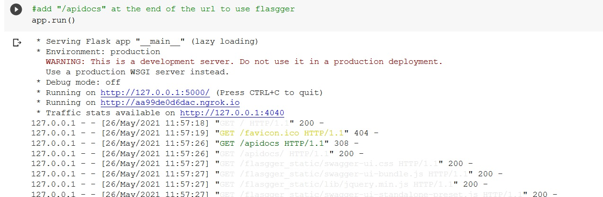
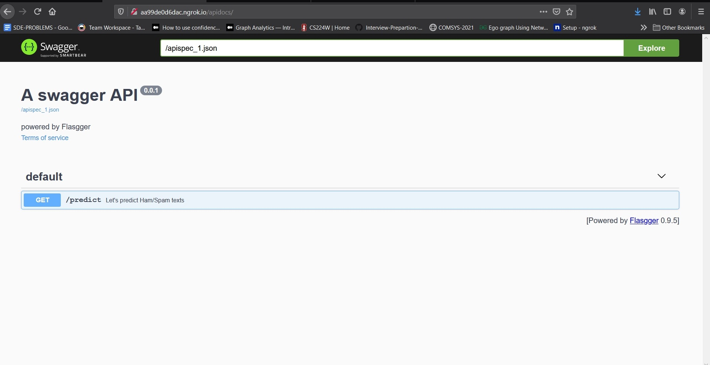
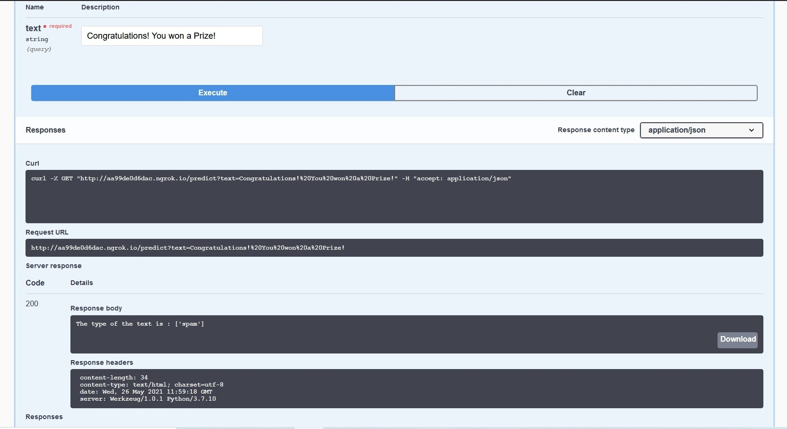
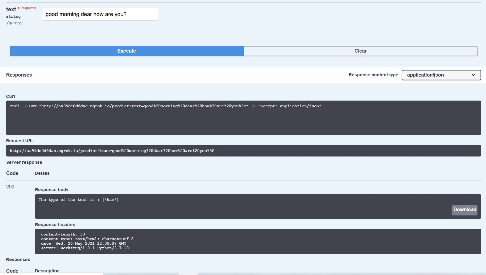

## Spam_Classifier_Flask_deploy

### About
Spam/Ham Classifier creation and its deployment using Flask, Frontend creation using Flasgger and URL generation using Ngrok 

### Model Training and Pickling
We have used a small training dataset of around 1400 instances of Spam and Ham SMS to train our model (Naive Byes Classifier). The Dataset can be found at spam1.csv 
After training we have created a pickle file of the classifier that can be found at classifier.pkl 

### App Deployment
We have used the Flask framework for the deployment and the Flasgger library to create an instantaneous Frontend UI. Since we have used the Colab Notebook to run the app, we were unable to access localhost that's why we have used ngrok library to create a URL. 
 
 

 
Add "/apidocs" at the end of the second URL and run on your browser. 

### Flasgger
After opening the URL, the homepage would look something like this: 
 

 

Type some texts to check their category:  
  
 

### Tools used:

Classifier Model : Naive Bayes 
App Framework    : Flask 
Frontend UI      : Flasgger 
URL Generation   : Ngrok 
